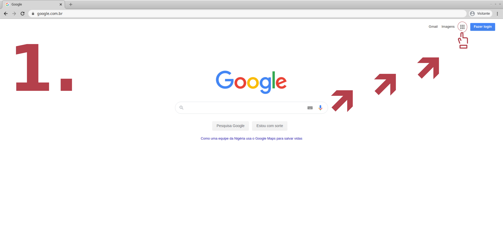
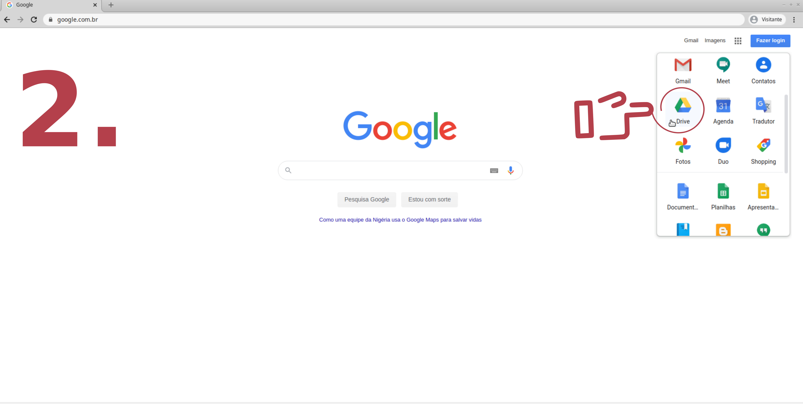
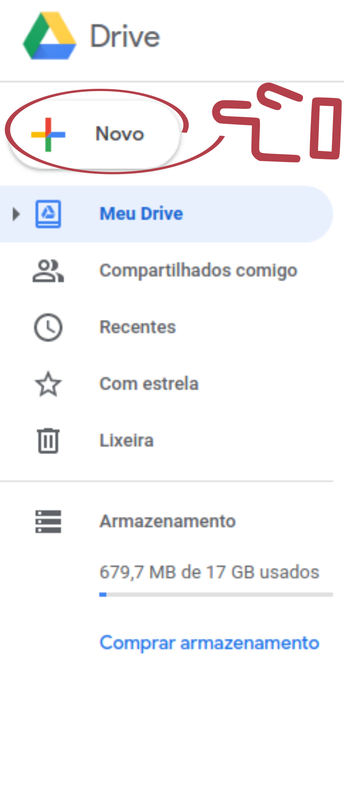
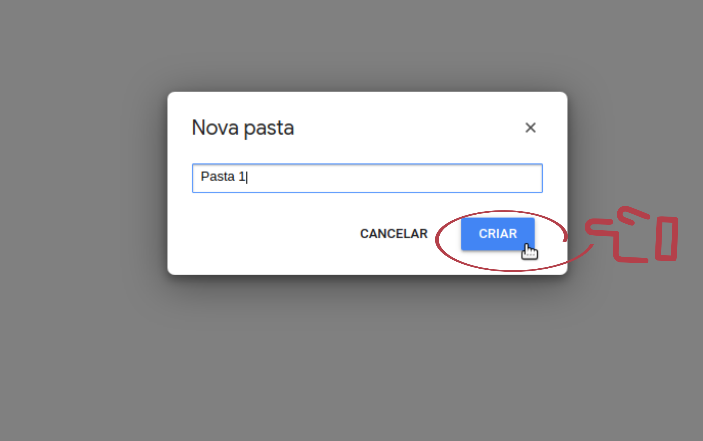

# Entendendo o Google Drive

## O que é o Google Drive ?

- O Google Drive é uma ferramenta gratuita do Google que possui três principais funções:

    1. **Repositório online**: você pode guardar e organizar arquivos (de qualquer tipo, como documentos, planilhas, fotos e vídeos) e organizá-los em pastas, como você faz em seu computador.

    2. **Ferramentas para produção de arquivos online**: você pode produzir arquivos de maneira online como planilhas, documentos, imagens, apresentações e formulários. As ferramentas são muito similares às do pacote Office, como Word e Excel.

    3. **Compartilhamento e colaboração**: os arquivos e as pastas podem ser compartilhados com outras pessoas e você escolhe se será apenas para visualização ou se elas podem editar também.

## Por que usar o Google Drive ?

- Para tentar lhe vender esse peixe, vamos trazer uma pequena tabela mostrando alguns pontos positivos ao usar Google Drive

Você ganha | Como ganha ?
----------|------------
Espaço    | Você possui 15 gigabytes (GB) gratuitos para armazenar suas coisas e isso é MUITO espaço  
Segurança | A chance de perder arquivos guardados no Drive é menor do que em seu computador ou dispositivos como Pen Drive e Celular. O risco de ocorrer um problema físico com um desses dispositivos é maior do que um problema digital em sua conta no Drive.
Facilidade de acesso | Você consegue acessar seus arquivos de qualquer lugar em qualquer dispositivo que esteja conectado à internet
Salvamento automaticamente | Ele salva automaticamente todas as atualizações que você faz, mas é preciso que você esteja conectado à internet. Por exemplo, caso você esteja escrevendo um texto utilizando diretamente o editor de texto do Drive (o Doc) e a energia elétrica acabar, você não corre o risco de perder esse trabalho já que ele estará salvo em sua conta no Drive.

## Como usar o Google Drive na educação ?

- A primeira grande vantagem que o Google Drive oferece para os usuários na educação é a sua capacidade de armazenamento de arquivos.

- A facilidade na recuperação desses arquivos é uma outra grande vantagem, é bem fácil acabar deletando algum arquivo sem querer e é ainda mais fácil perder um pedaço de papel ou folha.

- O potencial para organizar e otimização dos processos de trabalho são outros pontos positivos do Google Drive, Ou seja, uma das principais maneiras de usá-lo na educação é usando a ferramenta para guardar e organizar todo o seu material.

---------------------------------------------------------------------------------------------------------------------------------------------------------------

## Como acessar o Google Drive ?

- É importante lembrar que para ter acesso a qualquer ferramenta do Google é necessário ter uma conta Google, que geralmente adquirimos quando criamos um email do Gmail, ou para uso de um celular Android. Somente assim você conseguirá utilizar todas as funcionalidades.

### No computador

- Veja dois caminhos possíveis para acessar o Drive pelo o computador:

#### Link direto

- Uma alternativa muito conhecida é inserir a URL (O endereço completo) na barra de endereço. Se preferir fazer assim, acesse: https://drive.google.com/drive .

#### Google Apps

- Uma outra forma de abrir o Google Drive é, com a página do Google aberta vá em Google Apps e faça como nas imagens a seguir:

---------------------------------------------------------------------------------------------------------------------------------------------------------------

## Criando uma pasta

1. Acesse https://drive.google.com/drive no computador.

2. À esquerda, clique em "Novo" e "Pasta".

  

  

3. Digite um nome para a pasta e clique em Criar. (Dê um nome para pasta de forma sugestiva, onde o nome dê bem a entender o que tem nela e também que seja fácil de pesquisa)

  

4. Confira se sua pasta foi criada

  

---------------------------------------------------------------------------------------------------------------------------------------------------------------
## Recomendamos

- Entenda o conceito de Computação em Nuvem : https://www.infoescola.com/informatica/computacao-em-nuvem/
- Liberar espaço no Google Drive e aumentar o armazenamento: https://support.google.com/drive/answer/6374270#drive_space

## Resumo

- O Google Drive é Gratuito.
- Uma conta do Google Drive lhe dar 15 gigabytes (GB) gratuitos para armazenar suas coisas.
- Ele salva automaticamente todas as atualizações que você faz, mas é preciso que você esteja conectado à internet.
- Você pode compartilhar seus arquivos com outras pessoas.
